# AudioGeneration_MNIST

---
**TC3002B: Desarrollo de aplicaciones avanzadas de ciencias computacionales (Gpo 201)**

**Mónica Andrea Ayala Marrero - A01707439**

---

#### About the proyect

This project employs a **Variational Autoencoder for autonomous audio generation and reconstruction** based .wav audio files transformed into Short Fourier Transform Spectrograms. The dataset employed is the [free-spoken-digit-dataset](https://github.com/Jakobovski/free-spoken-digit-dataset/tree/master/recordings), also known as an audio version of the MNIST digit dataset.

**A google collaboratory project is set up [here!](https://drive.google.com/drive/folders/1CSRSAaPM1JtvCc9kbM5GsdVGh3QEqPuO?usp=sharing)**


#### About the model

A Variational Autoencoder (VAE) is a type of generative model in deep learning that consists of an encoder and a decoder, similar to traditional autoencoders. However, the key distinction lies in how it handles the encoding process. Unlike standard autoencoders that compress input data into a fixed point in the latent space, a VAE encodes data as a distribution within this space. This approach allows the model to not only learn the specific features of the input data but also the variability and uncertainty associated with these features, enabling it to generate new data points that are similar yet diverse. 


**Training a VAE step by step:**
- The input is encoded as distribution over the latent space.
- We sample a point from the latent space from that distribution.
- The sampled point is decoded and the reconstruction error can be computed.
- The reconstruction error is backpropagated through the network.

During my work on this project, I tried two types of variational autoencoders to solve this problem. In the end, the best performing model was the Standard VAE.


#### Standard VAE

In [Standard_VAE.py](https://github.com/monica-ayala/AudioGeneration_MNIST/blob/main/Standard_VAE.py) we have defined a standard variaitonal autoencoder. The architecture is the following:

##### VAE
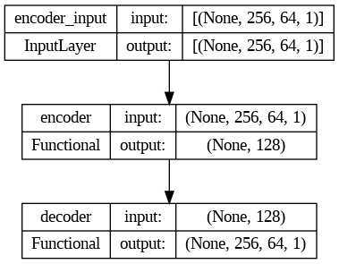

##### Encoder
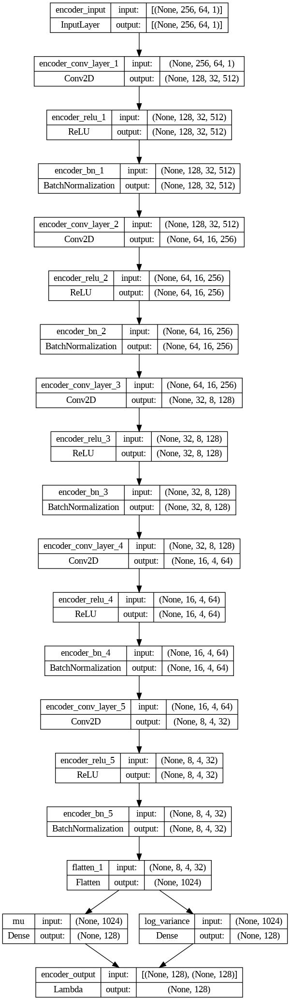

##### Decoder
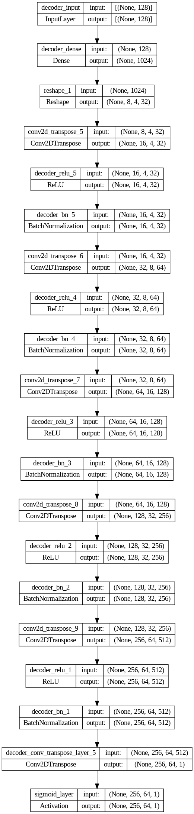
At the end of the encoder we map the mean and the variance to 128 latent variables (dimensions) to then sample a point from this normal distribution that will be the actual output of our encoder to pass into our decoder.

```
x = Flatten()(x)
    mu = Dense(latent_space_dim, name="mu")(x)
    log_variance = Dense(latent_space_dim, name="log_variance")(x)

def sample_point_from_normal_distribution(args):
        mu, log_variance = args
        epsilon = K.random_normal(shape=K.shape(mu), mean=0., stddev=1.)
        return mu + K.exp(log_variance / 2) * epsilon

    encoder_output = Lambda(
        sample_point_from_normal_distribution,
        name="encoder_output"
    )([mu, log_variance])
```

The loss functions we use in this standard VAE are the Mean Square Error and the Kullback–Leibler Divergence. The MSE loss is the reconstruction loss, that meassures how the output of the VAE is similar to its input during training, and the KL Divergence loss is the one that quantifies the differences between two distributions.

**What distributions, though?** The standard distribution and the encoded distribution, as the KL Divergence serves as regularization so that the encoded distributions aren't far from each other, avoiding overfitting by not having the means be too distant or the variances too small.


The code to do this combined loss function is the following, which we will pass when we compile our model. In Standard VAE the tradeoff between these two losses is easier to manage. 

```
def combined_loss(y_target, y_predicted, mu, log_variance, reconstruction_loss_weight):
    reconstruction_loss = K.mean(K.square(y_target - y_predicted), axis=[1, 2, 3])
    kl_loss = -0.5 * K.sum(1 + log_variance - K.square(mu) - K.exp(log_variance), axis=1)
    return reconstruction_loss_weight * reconstruction_loss + kl_loss
```

#### Mixture of Gaussian Distributions VAE

[Here](https://github.com/monica-ayala/AudioGeneration_MNIST/blob/main/VAE_MNIST.ipynb) we can find the implementation for a VAE based on a mixture of gaussian distributions. In this implementation of VAE we have to define a prior distribution, which we do with the help of tensorflow probability. This prior distribution is a mixture of gaussian distributions, parametrized by their means and a covariance matrix.

This is the key difference between the models, the complexity of the latent space reprsentation as well as the different way we calculate the loss. In this VAE we also use the KL Divergence but our reconstruction loss is defined as the logarithmic distance between the input and the output.

```
def reconstruction_loss(batch_of_images, decoding_dist):
    return -tf.reduce_sum(decoding_dist.log_prob(batch_of_images), axis = 0)
```

The architecture in it of itself is very similar to that of the Standard VAE.

##### Encoder

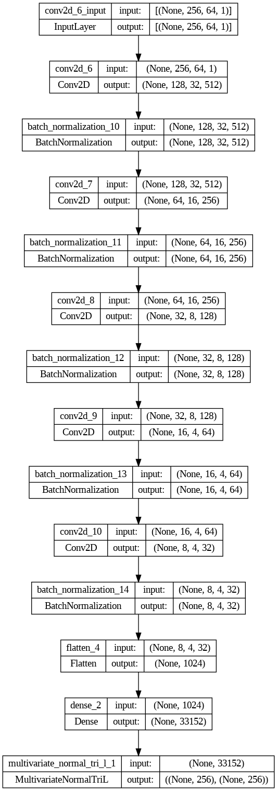

##### Decoder

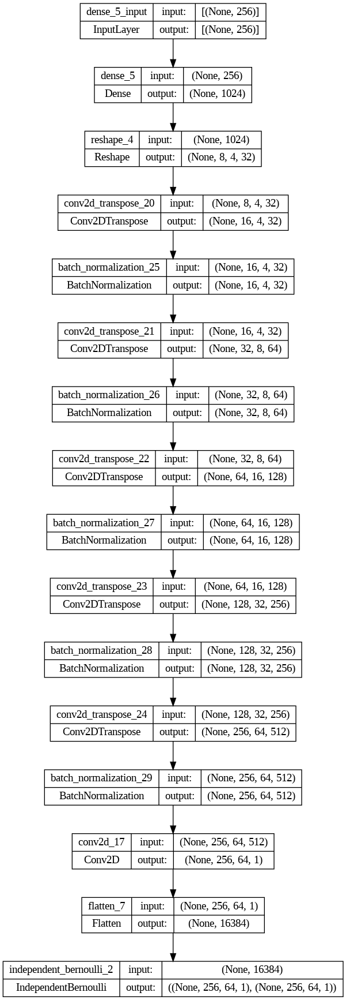

#### Why Standard VAE?

It seems that the reconstruction loss made the Mixture Gaussian VAE stagnate, even as it seemed to learn in less epochs than the Standard VAE. MSE reconstruction loss kept decreasing and allowed the Standard VAE model to learn the patterns of the data after around 250 epochs. 

*Note: Both these aproaches had been previously implemented in other open source projects, in the case of the gaussian mixture vae I was basing myself on the [CelebA VAE](https://colab.research.google.com/github/goodboychan/goodboychan.github.io/blob/main/_notebooks/2021-09-14-03-Variational-AutoEncoder-Celeb-A.ipynb) and on the case of the standard VAE, in the implementation of Valerio Velardo's [sound generation VAE](https://github.com/musikalkemist/generating-sound-with-neural-networks/blob/main/14%20Sound%20generation%20with%20VAE/code/generate.py).*

#### Results

Here are some reconstructions of files in the training dataset.

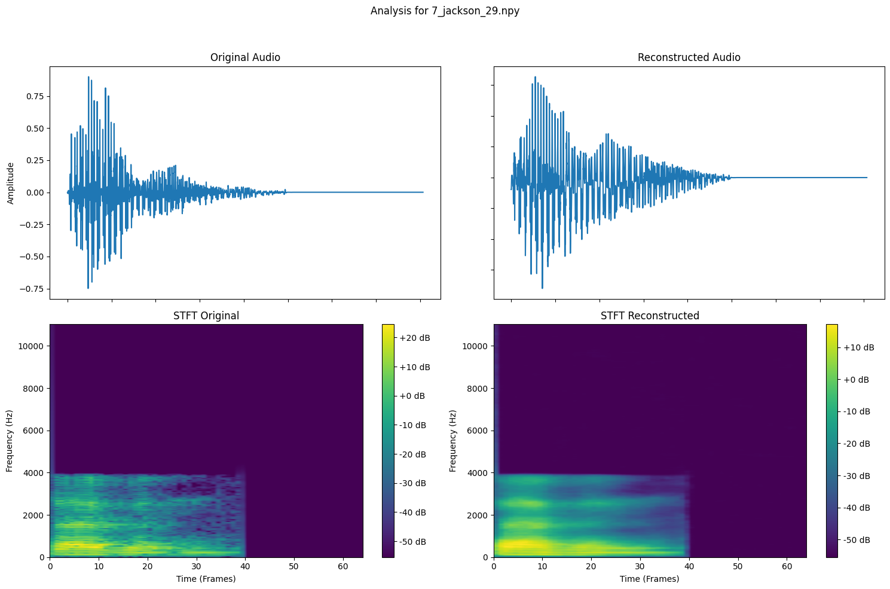

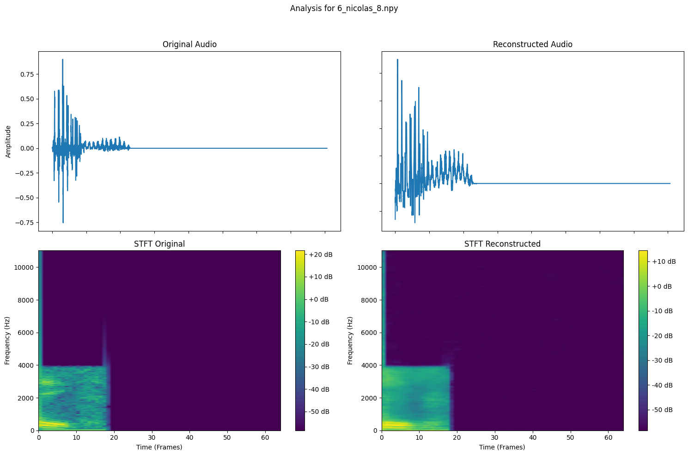

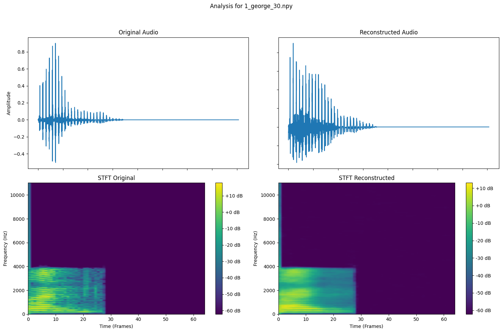

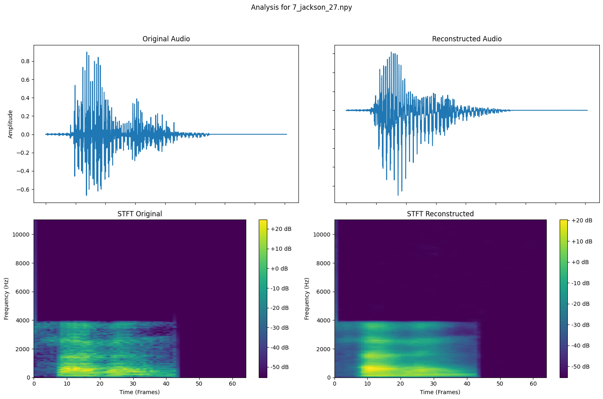

For comparison here are reconstructions of files in the test dataset, never seen by our model and recorded by me.

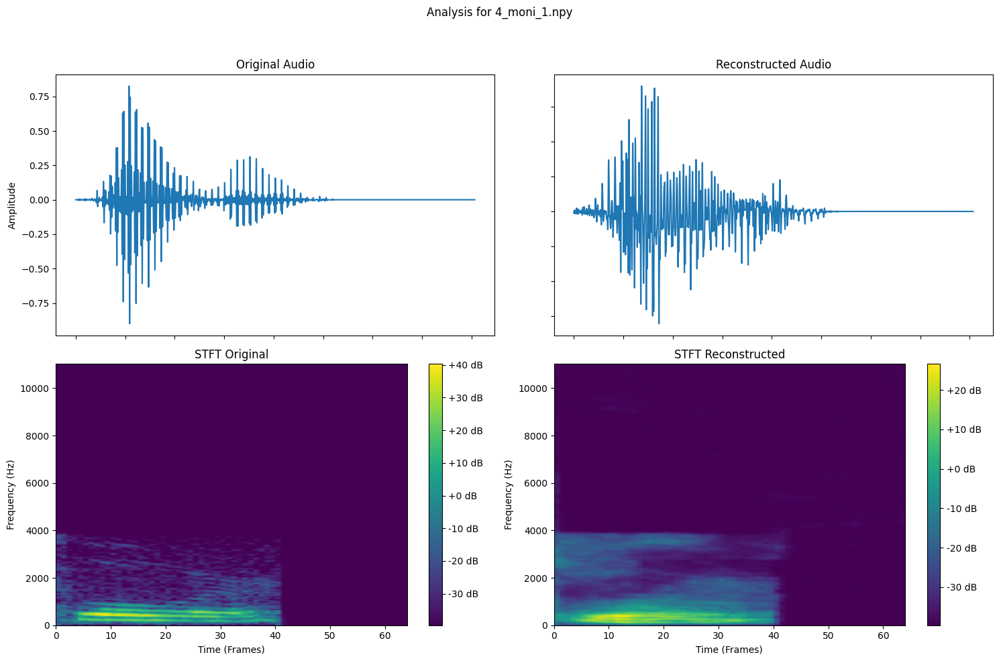

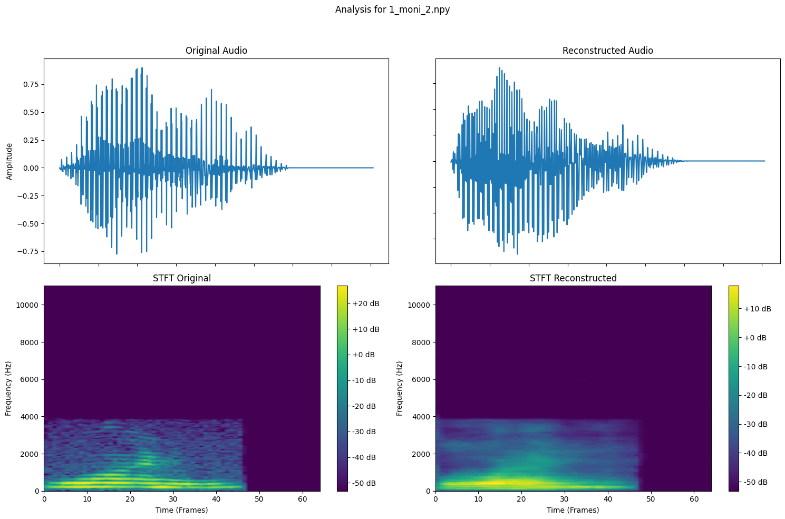

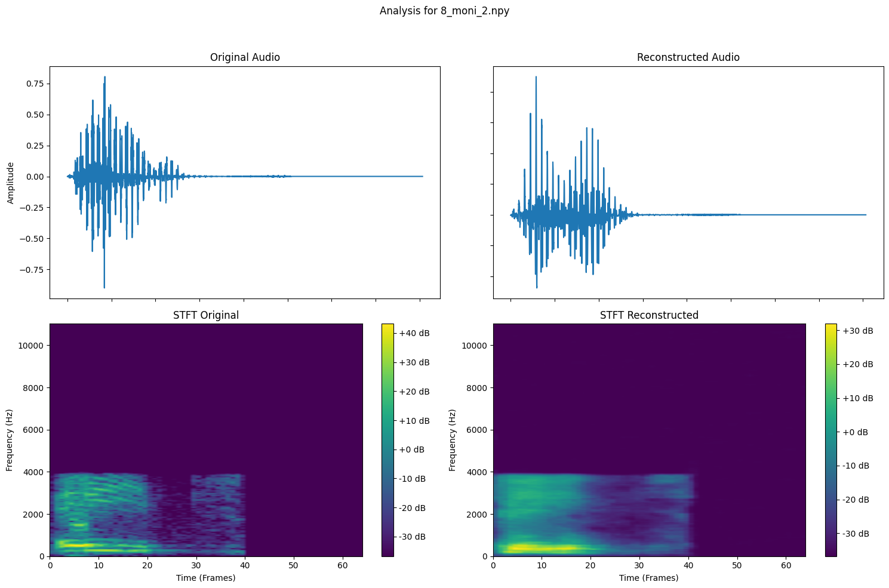

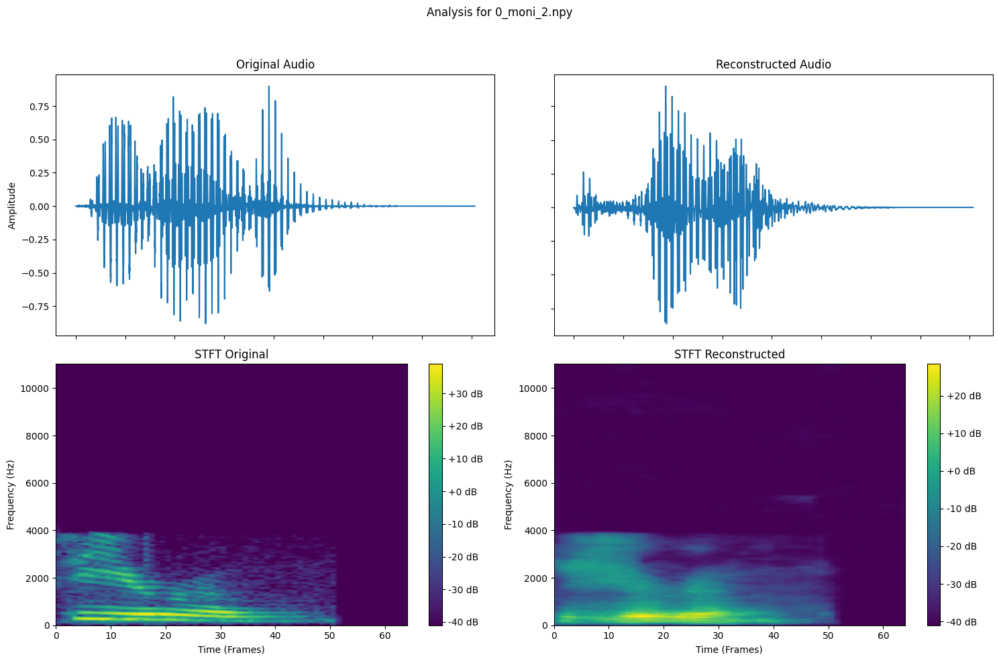

Then the generation:

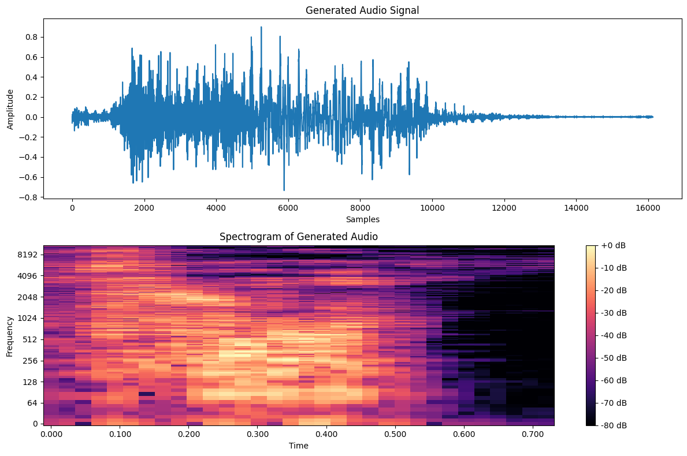

And some plots of the latent space representation:
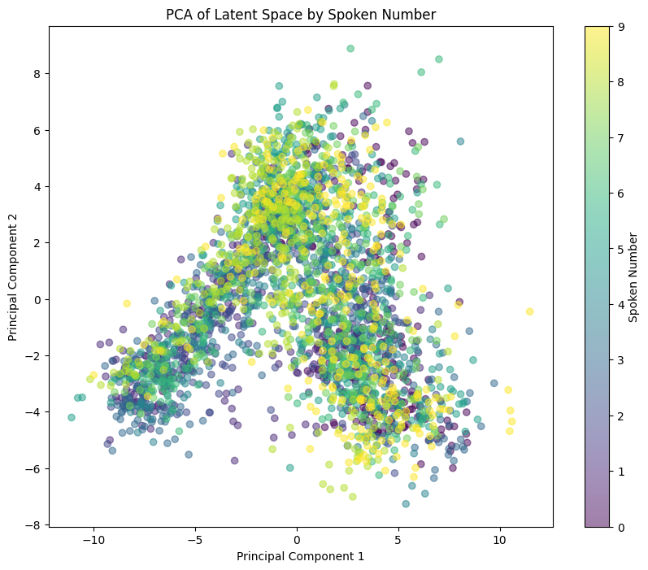

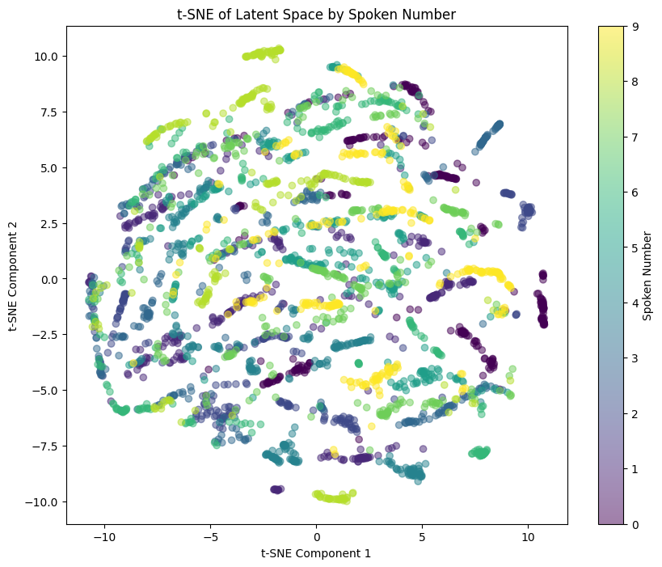