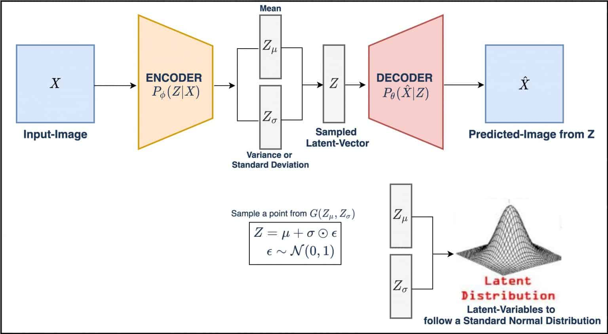
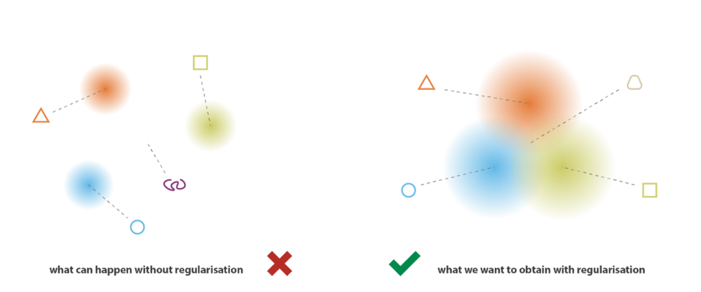

# AudioGeneration_MNIST

---
**TC3002B: Desarrollo de aplicaciones avanzadas de ciencias computacionales (Gpo 201)**

**Mónica Andrea Ayala Marrero - A01707439**

---

#### About the model

This project employs a **Variational Autoencoder for autonomous audio generation** based on spectogram reconstruction. The best model can be found [here](https://drive.google.com/drive/folders/1SIby6IPzSsLkenQCUV8todo2UaWzTu_f?usp=sharing).


A Variational Autoencoder (VAE) is a deep learning generative model that ties an encoder and a decoder together, like any autoencoder, but instead of encoding inputs as single points in the latent space, we encode it as a *distribution* in the latent space. The basic gist of it is the following:




1. The input is encoded as distribution over the latent space
2. We sample a point from the latent space from that distribution
3. The sampled point is decoded and the reconstruction error can be computed
4. The reconstruction error is backpropagated through the network

Now, in this project we have employed two very different types of VAE and it is reflected on the architecture of the model, especially of the codification of the latent space and of the loss functions.

##### Standard VAE

In [file] we have defined a standard variaitonal autoencoder, where we map the mean and the variance to 128 latent variables (dimensions) at the end of the encoder.

```
x = Flatten()(x)
    mu = Dense(latent_space_dim, name="mu")(x)
    log_variance = Dense(latent_space_dim, name="log_variance")(x)
```

and then we sample a point from this normal distribution that will be the actual output of our encoder to pass into our decoder.

```
def sample_point_from_normal_distribution(args):
        mu, log_variance = args
        epsilon = K.random_normal(shape=K.shape(mu), mean=0., stddev=1.)
        return mu + K.exp(log_variance / 2) * epsilon

    encoder_output = Lambda(
        sample_point_from_normal_distribution,
        name="encoder_output"
    )([mu, log_variance])
```

The loss functions we use in this standard VAE are the Mean Square Error and the Kullback–Leibler Divergence. The MSE loss is the reconstruction loss, that meassures how the output of the VAE is similar to its input during training, and the KL Divergence loss is the one that quantifies the differences between two distributions.

What distributions? The standard distribution and the encoded distribution, as the KL Divergence serves as regularization so that the encoded distributions aren't far from each other, avoiding overfitting by not having the means be too distant or the variances too small.



The code to do this combined loss function is the following, which we will pass when we compile our model. In Standard VAE the tradeoff between these two losses is easier to manage. 

```
def combined_loss(y_target, y_predicted, mu, log_variance, reconstruction_loss_weight):
    reconstruction_loss = K.mean(K.square(y_target - y_predicted), axis=[1, 2, 3])
    kl_loss = -0.5 * K.sum(1 + log_variance - K.square(mu) - K.exp(log_variance), axis=1)
    return reconstruction_loss_weight * reconstruction_loss + kl_loss
```

##### Mixture of Gaussian Distributions VAE

Here we can find the implementation for a VAE based on a mixture of gaussian distributions. In this implementation of VAE we have to define a prior distribution, which we do with the help of tensorflow probability. This prior distribution is a mixture of gaussian distributions, parametrized by their means and a covariance matrix 


#### RESULTS SO FAR


